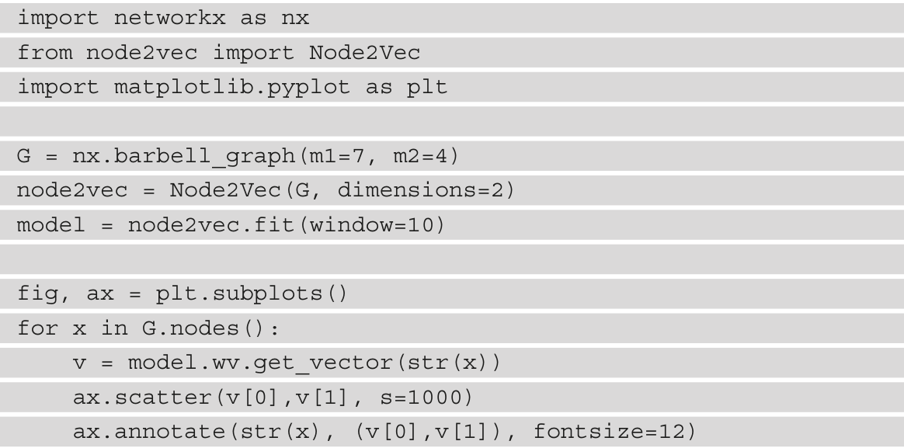
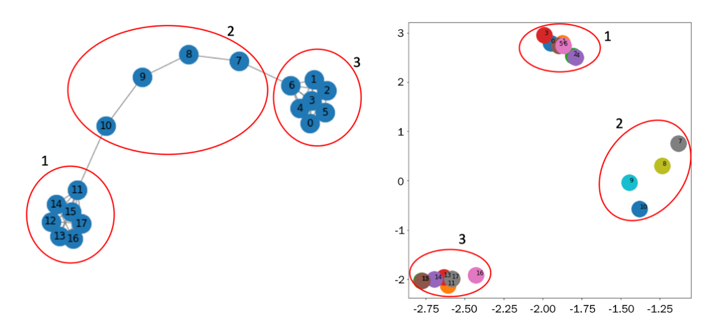
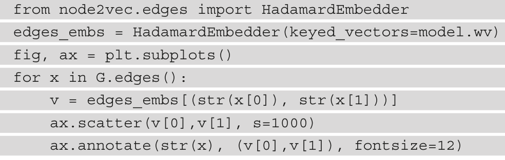
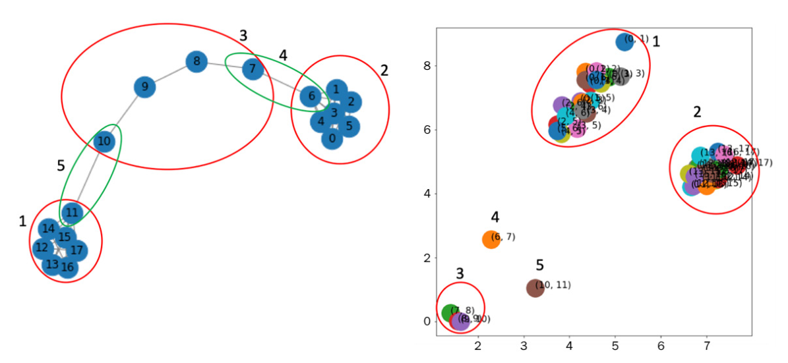
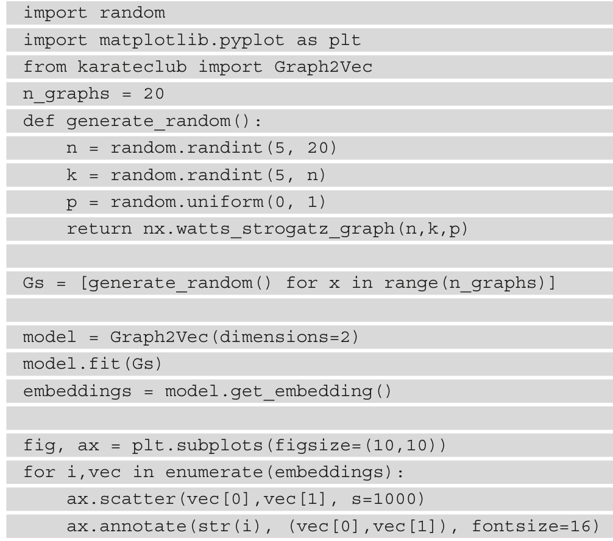
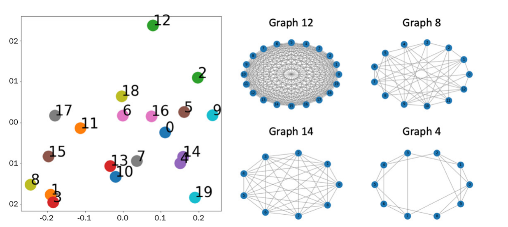

# Explanation 1

we show an example using a particular embedding algorithm known as Node to Vector (Node2Vec).

In the preceding code, we have done the following:
1. We generated a barbell graph (described in the previous chapter).
2. The Node2Vec embedding algorithm is then used in order to map each node of the
graph in a vector of two dimensions.
3. Finally, the two-dimensional vectors generated by the embedding algorithm,
representing the nodes of the original graph, are plotted.

The result is shown in the following figure:

it is easy to see that nodes that have a similar structure are close to each
other and are distant from nodes that have dissimilar structures. It is also interesting
to observe how good Node2Vec is at discriminating group 1 from group 3. Since the
algorithm uses neighboring information of each node to generate the representation, the
clear discrimination of those two groups is possible.

Another example on the same graph can be performed using the Edge to Vector
(Edge2Vec) algorithm in order to generate a mapping for the edges for the same graph, G:

In the preceding code, we have done the following:
1. We generated a barbell graph (described in the previous chapter).
2. The HadamardEmbedder embedding algorithm is applied to the result of the
Node2Vec algorithm (keyed_vectors=model.wv) used in order to map each
edge of the graph in a vector of two dimensions.
3. Finally, the two-dimensional vectors generated by the embedding algorithm,
representing the nodes of the original graph, are plotted.
The results are shown in the following figure:

From the figure, it is easy to see that the edge embedding algorithm clearly
identifies similar edges. As expected, edges belonging to groups 1, 2, and 3 are clustered in
well-defined and well-grouped regions. Moreover, the (6,7) and (10,11) edges, belonging
to groups 4 and 5, respectively, are well clustered in specific groups.

Finally, we will provide an example of a Graph to Vector (Grap2Vec) embedding
algorithm. This algorithm maps a single graph in a vector. As for another example, we
will discuss this algorithm in more detail in the next chapter. In the following code block,
we provide a Python example showing how to use the Graph2Vec algorithm in order to
generate the embedding representation on a set of graphs:

In this example, the following has been done:
1. 20 Watts-Strogatz graphs (described in the previous chapter) have been generated
with random parameters.
2. We have then executed the graph embedding algorithm in order to generate a
two-dimensional vector representation of each graph.
3. Finally, the generated vectors are plotted in their Euclidean space.
The results of this example are the following:

graphs with a large Euclidean distance, such as graph 12
and graph 8, have a different structure. The former is generated with the nx.watts_
strogatz_graph(20,20,0.2857) parameter and the latter with the nx.watts_
strogatz_graph(13,6,0.8621) parameter. In contrast, a graph with a low
Euclidean distance, such as graph 14 and graph 8, has a similar structure. Graph 14 is
generated with the nx.watts_strogatz_graph(9,9,0.5091) command, while
graph 4 is generated with nx.watts_strogatz_graph(10,5,0.5659).

