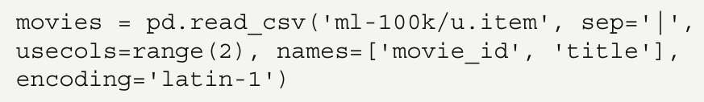
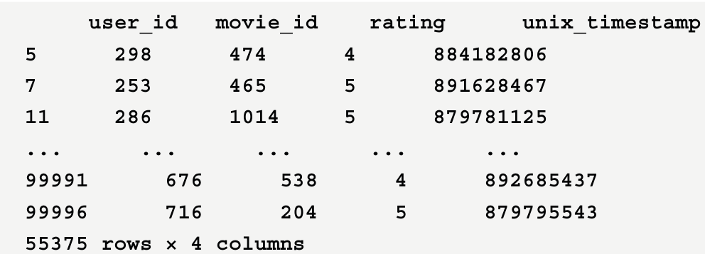
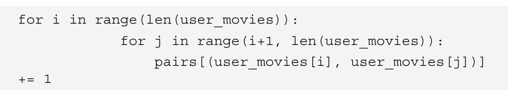
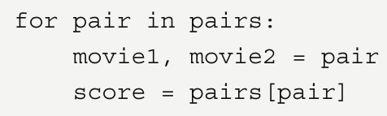
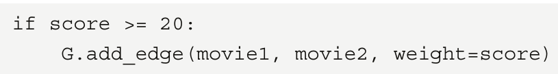

# Recommender Systems using Node2Vec

One of the most popular applications of GNNs is RecSys. If you think about the foundation of Word2Vec
(and, thus, DeepWalk and Node2Vec), the goal is to produce vectors with the ability to measure their
similarity. Encode movies instead of words, and you can suddenly ask for movies that are the most
similar to a given input title. It sounds a lot like a RecSys, right?
But how to encode movies? We want to create (biased) random walks of movies, but this requires a
graph dataset where similar movies are connected to each other. This is not easy to find.
Another approach is to look at user ratings. There are different techniques to build a graph based on
ratings: bipartite graphs, edges based on pointwise mutual information, and so on. In this section, we’ll
implement a simple and intuitive approach: movies that are liked by the same users are connected.
We’ll then use this graph to learn movie embeddings using Node2Vec:

1. First, let’s download a dataset. MovieLens [2] is a popular choice, with a small version of
the latest dataset (09/2018) comprising 100,836 ratings, 9,742 movies, and 610 users. We can
download it with the following Python code:

2. We are interested in two files: ratings.csv and movies.csv. The first one stores all the
ratings made by users, and the second one allows us to translate movie identifiers into titles.
3. Let’s see what they look like by importing them with pandas using pd.read_csv():

4. This gives us the following output:

5. Let’s import movies.csv now:

   

6.  This dataset gives us this output:

   

7.  Here, we want to see movies that have been liked by the same users. This means that ratings
such as 1, 2, and 3 are not very relevant. We can discard those and only keep scores of 4 and 5:

8. This gives us the following output:

    

9. We now have 48,580 ratings made by 610 users. The next step is to count every time that two
movies are liked by the same user. We will repeat this process for every user in the dataset.

10. To simplify things, we will use a defaultdict data structure, which automatically creates
missing entries instead of raising an error. We’ll use this structure to count movies that are
liked together:

11. We loop through the entire list of users in our dataset:

12. We retrieve the list of movies that have been liked by the current user:

13. We increment a counter specific to a pair of movies every time they are seen together in the
same list:

14. The pairs object now stores the number of times two movies have been liked by the same
user. We can use this information to build the edges of our graph as follows.

15. We create a graph using the networkx library:

16. For each pair of movies in our pairs structure, we unpack the two movies and their
corresponding score:

17. If this score is higher than 10, we add a weighted link to the graph to connect both movies
based on this score. We don’t consider scores lower than 10 because that would create a large
graph in which connections were less meaningful:

18. The graph we created has 410 nodes (movies) and 14,936 edges. We can now train Node2Vec
on it to learn the node embeddings!

 

