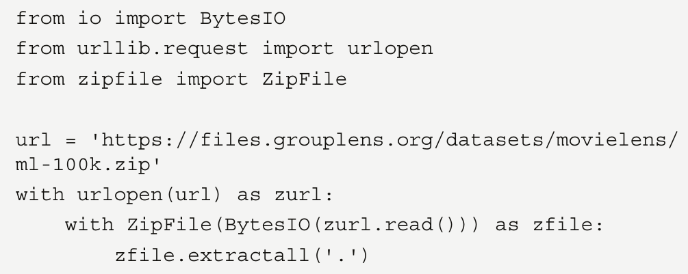

# Recommender Systems using Node2Vec

One of the most popular applications of GNNs is RecSys. If you think about the foundation of Word2Vec
(and, thus, DeepWalk and Node2Vec), the goal is to produce vectors with the ability to measure their
similarity. Encode movies instead of words, and you can suddenly ask for movies that are the most
similar to a given input title. It sounds a lot like a RecSys, right?
But how to encode movies? We want to create (biased) random walks of movies, but this requires a
graph dataset where similar movies are connected to each other. This is not easy to find.
Another approach is to look at user ratings. There are different techniques to build a graph based on
ratings: bipartite graphs, edges based on pointwise mutual information, and so on. In this section, we’ll
implement a simple and intuitive approach: movies that are liked by the same users are connected.
We’ll then use this graph to learn movie embeddings using Node2Vec:

1. First, let’s download a dataset. MovieLens [2] is a popular choice, with a small version of
the latest dataset (09/2018) comprising 100,836 ratings, 9,742 movies, and 610 users. We can
download it with the following Python code:

2. We are interested in two files: ratings.csv and movies.csv. The first one stores all the
ratings made by users, and the second one allows us to translate movie identifiers into titles.
3. Let’s see what they look like by importing them with pandas using pd.read_csv():

