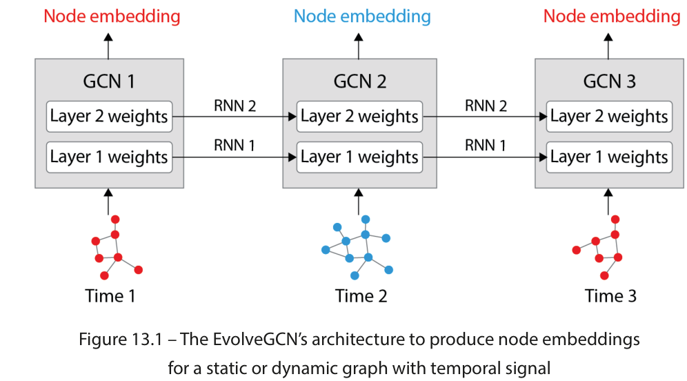

# Explanation 5

## Introducing dynamic graphs

Dynamic graphs and temporal GNNs unlock a variety of new applications, such as transport and web
traffic forecasting, motion classification, epidemiological forecasting, link prediction, power system
forecasting, and so on. Time series forecasting is particularly popular with this kind of graph, as we
can use historical data to predict the system’s future behavior.
In this chapter, we focus on graphs with a temporal component. They can be divided into two categories:
• Static graphs with temporal signals: The underlying graph does not change, but features and
labels evolve over time.
• Dynamic graphs with temporal signals: The topology of the graph (the presence of nodes
and edges), features, and labels evolve over time.
In the first case, the graph’s topology is static. For example, it can represent a network of cities within
a country for traffic forecasting: features change over time, but the connections stay the same.
In the second option, nodes and/or connections are dynamic. It is useful to represent a social network
where links between users can appear or disappear over time. This variant is more general, but also
harder to learn how to implement.
we will see how to handle these two types of graphs with temporal signals
using PyTorch Geometric Temporal.

## Forecasting web traffic

we will predict the traffic of Wikipedia articles (as an example of a static graph with a
temporal signal) using a temporal GNN. This regression task has already been covered in Chapter 6,
Introducing Graph Convolutional Networks. However, in that version of the task, we performed traffic
forecasting using a static dataset without a temporal signal: our model did not have any information
about previous instances. This is an issue because it could not understand whether the traffic was
currently increasing or decreasing, for example. We can now improve this model to include information
about past instances.
We will first introduce the temporal GNN architecture with its two variants and then implement it
using PyTorch Geometric Temporal.

## Introducing EvolveGCN

For this task, we will use the EvolveGCN architecture. Introduced by Pareja et al. [1] in 2019, it proposes
a natural combination of GNNs and Recurrent Neural Networks (RNNs). Previous approaches,
such as graph convolutional recurrent networks, applied RNNs with graph convolution operators to
calculate node embeddings. By contrast, EvolveGCN applies RNNs to the GCN parameters themselves.
As the name implies, the GCN evolves over time to produce relevant temporal node embeddings. The
following figure illustrates a high-level view of this process.

This architecture has two variants:

1. EvolveGCN-H, where the recurrent neural network considers both the previous GCN parameters
and the current node embeddings
2. EvolveGCN-O, where the recurrent neural network only considers the previous GCN parameters

