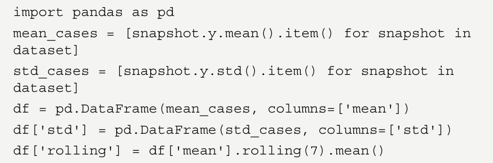
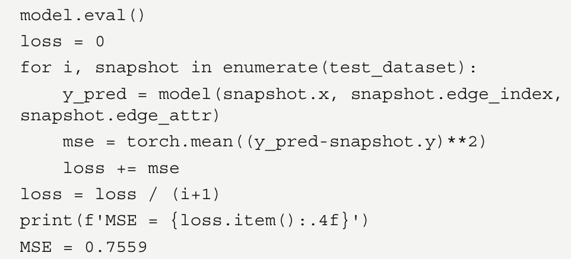
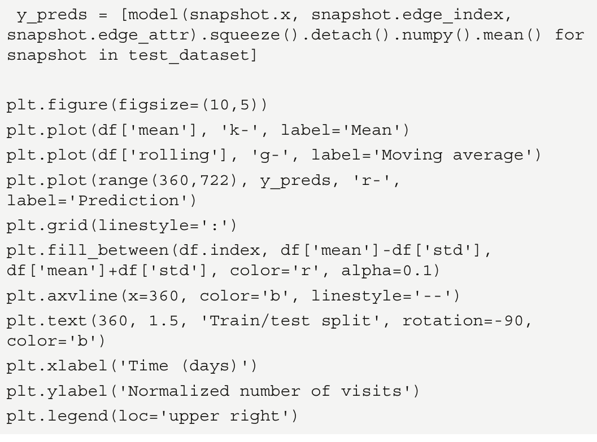

Esta es una página destinada a ilustrar el uso de GitHub para mostrar ejemplos importantes de Graph machine learning.
Este material hará parte del Libro Ciencia de redes.

> **Este material esta basado en el libro de Maxime Labonne, [Hands on Graph Neural networks Using Python](https://www.amazon.com/-/es/Maxime-Labonne-ebook/dp/B0BNNVZ3M2?ref_=ast_author_mpb), Packt Publishing**

## Ejemplo  1  (Uso de node2vec)

we show an example using a particular embedding algorithm known as Node to Vector (Node2Vec).

In the preceding code, we have done the following:
1. We generated a barbell graph (described in the previous chapter).
2. The Node2Vec embedding algorithm is then used in order to map each node of the
graph in a vector of two dimensions.
3. Finally, the two-dimensional vectors generated by the embedding algorithm,
representing the nodes of the original graph, are plotted.

The result is shown in the following figure:

it is easy to see that nodes that have a similar structure are close to each
other and are distant from nodes that have dissimilar structures. It is also interesting
to observe how good Node2Vec is at discriminating group 1 from group 3. Since the
algorithm uses neighboring information of each node to generate the representation, the
clear discrimination of those two groups is possible.

Another example on the same graph can be performed using the Edge to Vector
(Edge2Vec) algorithm in order to generate a mapping for the edges for the same graph, G:

In the preceding code, we have done the following:
1. We generated a barbell graph (described in the previous chapter).
2. The HadamardEmbedder embedding algorithm is applied to the result of the
Node2Vec algorithm (keyed_vectors=model.wv) used in order to map each
edge of the graph in a vector of two dimensions.
3. Finally, the two-dimensional vectors generated by the embedding algorithm,
representing the nodes of the original graph, are plotted.
The results are shown in the following figure:

From the figure, it is easy to see that the edge embedding algorithm clearly
identifies similar edges. As expected, edges belonging to groups 1, 2, and 3 are clustered in
well-defined and well-grouped regions. Moreover, the (6,7) and (10,11) edges, belonging
to groups 4 and 5, respectively, are well clustered in specific groups.

Finally, we will provide an example of a Graph to Vector (Grap2Vec) embedding
algorithm. This algorithm maps a single graph in a vector. As for another example, we
will discuss this algorithm in more detail in the next chapter. In the following code block,
we provide a Python example showing how to use the Graph2Vec algorithm in order to
generate the embedding representation on a set of graphs:

In this example, the following has been done:
1. 20 Watts-Strogatz graphs (described in the previous chapter) have been generated
with random parameters.
2. We have then executed the graph embedding algorithm in order to generate a
two-dimensional vector representation of each graph.
3. Finally, the generated vectors are plotted in their Euclidean space.
The results of this example are the following:

graphs with a large Euclidean distance, such as graph 12
and graph 8, have a different structure. The former is generated with the nx.watts_
strogatz_graph(20,20,0.2857) parameter and the latter with the nx.watts_
strogatz_graph(13,6,0.8621) parameter. In contrast, a graph with a low
Euclidean distance, such as graph 14 and graph 8, has a similar structure. Graph 14 is
generated with the nx.watts_strogatz_graph(9,9,0.5091) command, while
graph 4 is generated with nx.watts_strogatz_graph(10,5,0.5659).

## Ejemplo 2 Un sistema de recomendación de películas

One of the most popular applications of GNNs is RecSys. If you think about the foundation of Word2Vec
(and, thus, DeepWalk and Node2Vec), the goal is to produce vectors with the ability to measure their
similarity. Encode movies instead of words, and you can suddenly ask for movies that are the most
similar to a given input title. It sounds a lot like a RecSys, right?
But how to encode movies? We want to create (biased) random walks of movies, but this requires a
graph dataset where similar movies are connected to each other. This is not easy to find.
Another approach is to look at user ratings. There are different techniques to build a graph based on
ratings: bipartite graphs, edges based on pointwise mutual information, and so on. In this section, we’ll
implement a simple and intuitive approach: movies that are liked by the same users are connected.
We’ll then use this graph to learn movie embeddings using Node2Vec:

1. First, let’s download a dataset. MovieLens [2] is a popular choice, with a small version of
the latest dataset (09/2018) comprising 100,836 ratings, 9,742 movies, and 610 users. We can
download it with the following Python code:

2. We are interested in two files: ratings.csv and movies.csv. The first one stores all the
ratings made by users, and the second one allows us to translate movie identifiers into titles.
3. Let’s see what they look like by importing them with pandas using pd.read_csv():

4. This gives us the following output:

5. Let’s import movies.csv now:

   

6.  This dataset gives us this output:

   

7.  Here, we want to see movies that have been liked by the same users. This means that ratings
such as 1, 2, and 3 are not very relevant. We can discard those and only keep scores of 4 and 5:

8. This gives us the following output:

    

9. We now have 48,580 ratings made by 610 users. The next step is to count every time that two
movies are liked by the same user. We will repeat this process for every user in the dataset.

10. To simplify things, we will use a defaultdict data structure, which automatically creates
missing entries instead of raising an error. We’ll use this structure to count movies that are
liked together:

11. We loop through the entire list of users in our dataset:

12. We retrieve the list of movies that have been liked by the current user:

13. We increment a counter specific to a pair of movies every time they are seen together in the
same list:

14. The pairs object now stores the number of times two movies have been liked by the same
user. We can use this information to build the edges of our graph as follows.

15. We create a graph using the networkx library:

16. For each pair of movies in our pairs structure, we unpack the two movies and their
corresponding score:

17. If this score is higher than 10, we add a weighted link to the graph to connect both movies
based on this score. We don’t consider scores lower than 10 because that would create a large
graph in which connections were less meaningful:

18. The graph we created has 410 nodes (movies) and 14,936 edges. We can now train Node2Vec
on it to learn the node embeddings!

## Ejemplo 3  Grafos Dinámicos, predicción del Tráfico en la Web

###Introducing dynamic graphs

Dynamic graphs and temporal GNNs unlock a variety of new applications, such as transport and web
traffic forecasting, motion classification, epidemiological forecasting, link prediction, power system
forecasting, and so on. Time series forecasting is particularly popular with this kind of graph, as we
can use historical data to predict the system’s future behavior.
In this chapter, we focus on graphs with a temporal component. They can be divided into two categories:
• Static graphs with temporal signals: The underlying graph does not change, but features and
labels evolve over time.
• Dynamic graphs with temporal signals: The topology of the graph (the presence of nodes
and edges), features, and labels evolve over time.
In the first case, the graph’s topology is static. For example, it can represent a network of cities within
a country for traffic forecasting: features change over time, but the connections stay the same.
In the second option, nodes and/or connections are dynamic. It is useful to represent a social network
where links between users can appear or disappear over time. This variant is more general, but also
harder to learn how to implement.
we will see how to handle these two types of graphs with temporal signals
using PyTorch Geometric Temporal.

### Forecasting web traffic

we will predict the traffic of Wikipedia articles (as an example of a static graph with a
temporal signal) using a temporal GNN. This regression task has already been covered in Chapter 6,
Introducing Graph Convolutional Networks. However, in that version of the task, we performed traffic
forecasting using a static dataset without a temporal signal: our model did not have any information
about previous instances. This is an issue because it could not understand whether the traffic was
currently increasing or decreasing, for example. We can now improve this model to include information
about past instances.
We will first introduce the temporal GNN architecture with its two variants and then implement it
using PyTorch Geometric Temporal.

### Introducing EvolveGCN

For this task, we will use the EvolveGCN architecture. Introduced by Pareja et al. [1] in 2019, it proposes
a natural combination of GNNs and Recurrent Neural Networks (RNNs). Previous approaches,
such as graph convolutional recurrent networks, applied RNNs with graph convolution operators to
calculate node embeddings. By contrast, EvolveGCN applies RNNs to the GCN parameters themselves.
As the name implies, the GCN evolves over time to produce relevant temporal node embeddings. The
following figure illustrates a high-level view of this process.

This architecture has two variants:

1. EvolveGCN-H, where the recurrent neural network considers both the previous GCN parameters
and the current node embeddings.

3. EvolveGCN-O, where the recurrent neural network only considers the previous GCN parameters

### Implementing EvolveGCN

We want to forecast web traffic on a static graph with a temporal signal. The WikiMaths
dataset is comprised of 1,068 articles represented as nodes. Node features correspond to the past daily
number of visits (eight features by default). Edges are weighted, and weights represent the number of
links from the source page to the destination page. We want to predict the daily user visits to these
Wikipedia pages between March 16, 2019, and March 15, 2021, which results in 731 snapshots. Each
snapshot is a graph describing the state of the system at a certain time.

PyTorch Geometric does not natively support static or dynamic graphs with a temporal signal.
Fortunately, an extension called PyTorch Geometric Temporal [2] fixes this issue and even implements
various temporal GNN layers. The WikiMaths dataset was also made public during the development
of PyTorch Geometric Temporal. In this chapter, we will use this library to simplify the code and
focus on applications:

1. We need to install this library in an environment containing PyTorch Geometric:
pip install torch-geometric-temporal==0.54.0
2. We import the WikiMaths dataset, called WikiMathDatasetLoader, a temporal-aware
train-test split with temporal_signal_split, and our GNN layer, EvolveGCNH:

3. We load the WikiMaths dataset, which is a StaticGraphTemporalSignal object. In
this object, dataset[0] describes the graph (also called a snapshot in this context) at = 0
and dataset[500] at = 500 . We also create a train-test split with a ratio of 0.5. The
training set is composed of snapshots from the earlier time periods, while the test set regroups
snapshots from the later periods:

4. The graph is static, so the node and edge dimensions do not change. However, the values contained
in these tensors are different. It is difficult to visualize the values of each of the 1,068 nodes. To
better understand this dataset, we can calculate the mean and standard deviation values for each
snapshot instead. The moving average is also helpful in smoothing out short-term fluctuations.

5. We plot these time series with matplotlib to visualize our task:

This produces the following figure:

Our data presents periodic patterns that the temporal GNN can hopefully learn. We can now
implement it and see how it performs.
6. The temporal GNN takes two parameters as inputs: the number of nodes (node_count) and
the input dimension (dim_in). The GNN only has two layers: an EvolveGCN-H layer and a
linear layer that outputs a predicted value for each node:

7. The forward() function applies both layers to the input with a ReLU activation function:

8. We create an instance of TemporalGNN and give it the number of nodes and input dimension
9.  from the WikiMaths dataset. We will train it using the Adam optimizer:

9. We can print the model to observe the layers contained in EvolveGCNH:

We see three layers: TopKPooling, which summarizes the input matrix in eight columns;
GRU, which updates the GCN weight matrix; and GCNConv, which produces the new node
embedding. Finally, a linear layer outputs a predicted value for every node in the graph.

10. We create a training loop that trains the model on every snapshot from the training set. The
loss is backpropagated for every snapshot:

11. Likewise, we evaluate the model on the test set. The MSE is averaged on the entire test set to
produce the final score:

12. We obtain a loss value of 0.7559. Next, we will plot the mean values predicted by our model on
the previous graph to interpret it. The process is straightforward: we must average the predictions
and store them in a list. Then, we can add them to the previous plot:

We obtain the following:

We can see that the predicted values follow the general trend in the data. This is an excellent
result, considering the limited size of the dataset.

13. Finally, let’s create a scatter plot to show how predicted and ground truth values differ for a
single snapshot:

We observe a moderate positive correlation between predicted and real values. Our model is not
remarkably accurate, but the previous figure showed that it understands the periodic nature of the
data very well.
